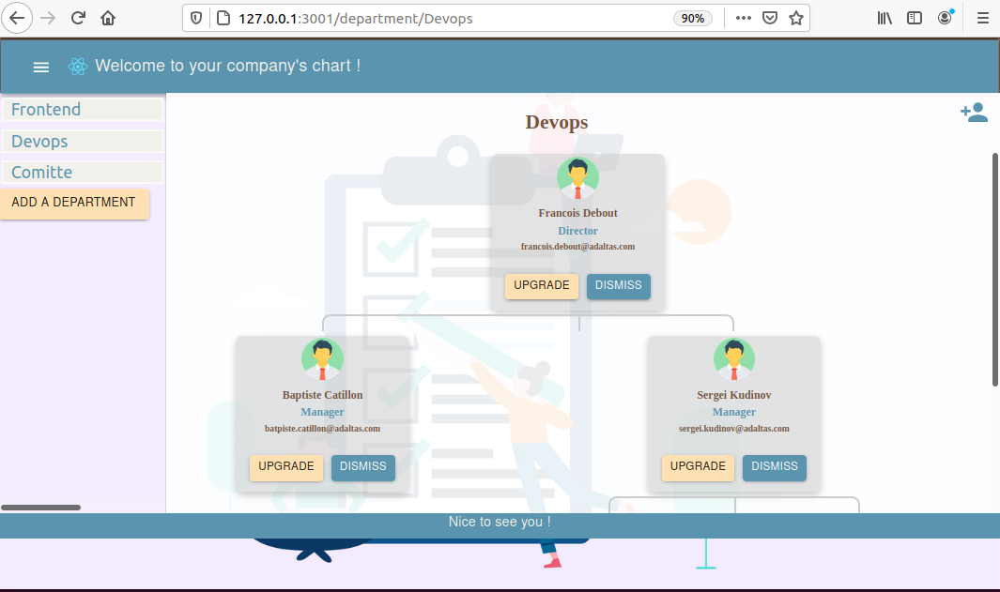
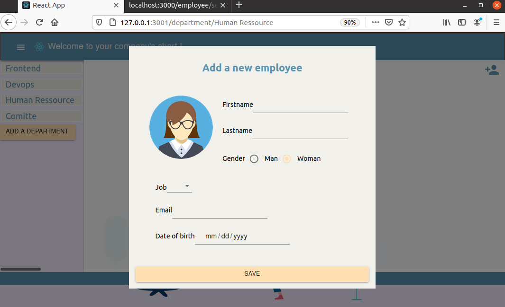

# DevOps App

This is an application Vivien and Clemence created. It is a basic NodeJS web application exposing REST API that creates and stores user parameters in [Redis database](https://redis.io/). To make the application more interesting, we decided to build it as a compagny's chart: see the employees of each department and decide to dismiss or upgrade them. Also, it is possible to add an employee to any department.

## Usage

### Initialization

It's possible to run and initialize the backend on port 3000, and redis on 6379 with containers orchestration:
```
cd backend
docker-compose up
```

Otherwise, in init file, we initialized three departments with employees. 
Redis-server on required.
To init :
```bash
$ npm --prefix backend install 
$ node backend/src/init
```

### Starting

Start the web application:

```bash
$ npm --prefix backend start  
```

```bash
$ npm --prefix frontend install 
$ npm --prefix frontend start
```
## Testing

From the root directory of the project, run:

```
npm --prefix backend test 
```

## Fonctionalities

### Web application

We implemented a web application that allows a Human Resources Manager, for example, to see his/her compagny's chart: get the employees of each department and decide to dismiss or upgrade them. Also, it is possible to add an employee to any department. 

* Our application ensures CRUD user funtionality. 
* We used Redis to store information. 
* We coded some tests for the connection, creation and listing of employees...

### CI/CD pipeline

We configured and applied CI/CD pipeline using Travis CI. Links : 
* Travis CI: https://travis-ci.com/github/VivienECE/devops-project

### IaC approach

We used Vagrant to configure and provision a virtual environment. And provision our VM with Ansible Provisioner to install and run:
* Nodejs
* Redis
* Our application (with sync folders)
* Health check of our application

### Docker image

We created a Docker image of our application and pushed it to Docker Hub. Link : https://hub.docker.com/repository/docker/vivienece/backend

### Docker Compose

We created a ``` docker-compose.yml``` file that starts our backend.
```
cd backend
docker-compose up
```

### Kurbernetes

Using Minikube, we installed Kubernetes and created yaml files:
* deployments
* services
* persistent volume and persistent volume claim


### Bonus

* We made more different API methods (see /backend/src/route).
* We made more different unit/functional/integration tests (see /backend/test).
* API Documentation : https://documenter.getpostman.com/view/13372911/TVsvi7e2

## Preview Frontend




## Authors

Vivien DETOURNAY and Clémence JEAN-LOUIS DIT MONTOUT
SI inter Gr01

